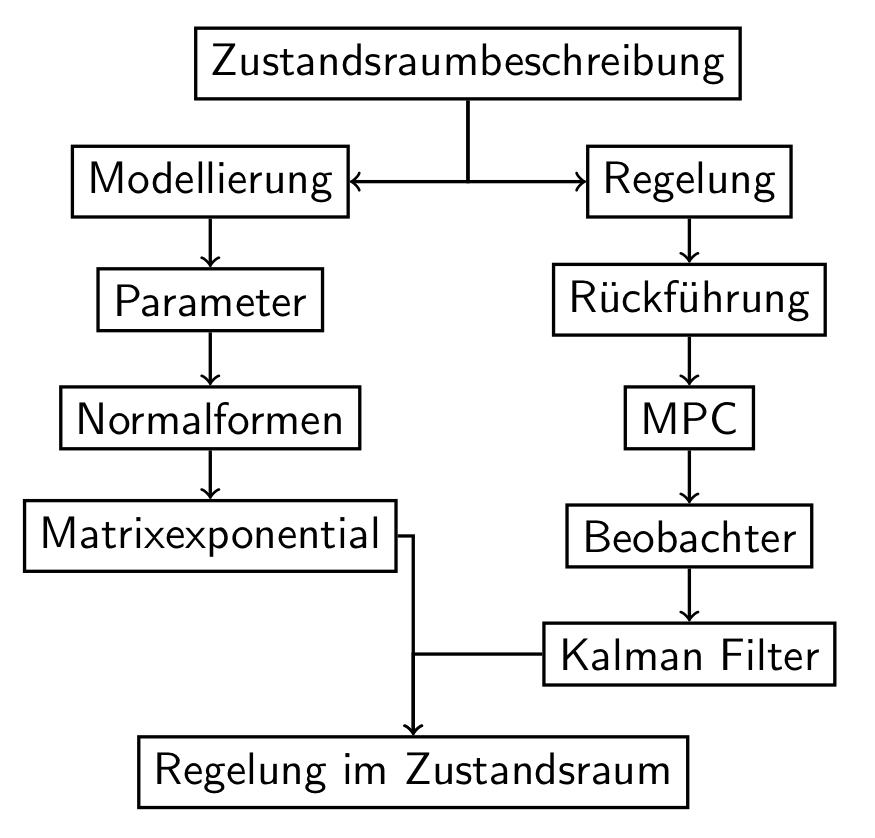

# 8574518 EFANT

## Lernziele

### Teil 1:

- Die Studierenden kennen die Zustandsraumbeschreibung, die Bedeutung von Polstellen und die Begriffe Steuerbarkeit und Beobachtbarkeit.
- Die Studierenden kennen die Normalformen der Zustandsbeschreibung und zugeh\"orige Blockdiagramme.
- Die Studierenden kennt die Blockdiagramme und resultierenden Systemmatrizen der Regelung im Zustandsraum sowie den Unterschied zwischen Zustan- und Ausgangsr\"uckf\"uhrung.

### Teil 2:

- Die Studierenden kennen Sch\"atzfunktionen und deren w\"unschenswerte Eigenschaften.
- Die Studierenden kennen den grunds\"atzlichen Aufbau der Prediction Error Methods (PEM) und ihre Eigenschaften.
- Die Studierenden k\"onnen den Kalman Filter als Zustandssch\"atzer sowie den RLS a\"ls Parametersch\"atzer anwenden und ihre Grenzen aufzeigen.

### Teil 3 (Rechnerpraktikum/Selbststudium):

- Die Studierenden k\"onnen dynamische Systeme im Zustandsraum simulieren.
- Die Studierenden k\"onnen Zustan- und Parametersch\"atzer in Scicos oder C implementieren.

### Struktur des Kurses

### Literatur

- G. F. Franklin, J. D. Powell, and A. Emami-Naeini. Feedback Control of Dynamic Systems. Pearson, 2010.
- L. Ljung. System Identification: Theory for the User. Upper Saddle River, NJ: PTR Prentice Hall, 1999.
- H. Unbehauen. Regelungstechnik II. Friedr. Vieweg und Sohn, 2007.